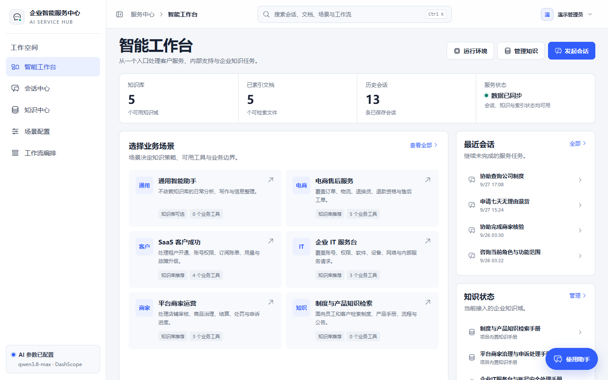
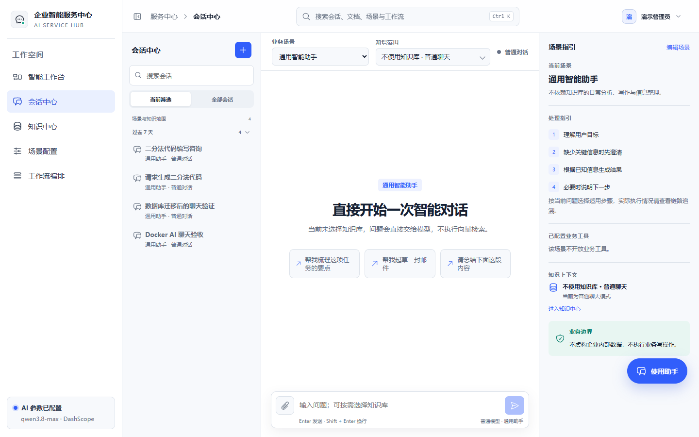
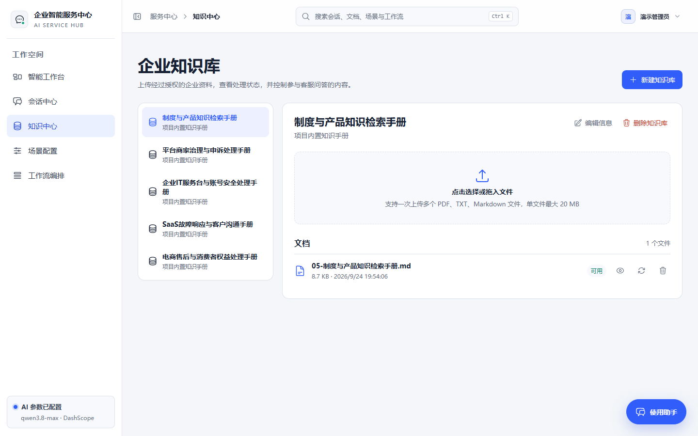
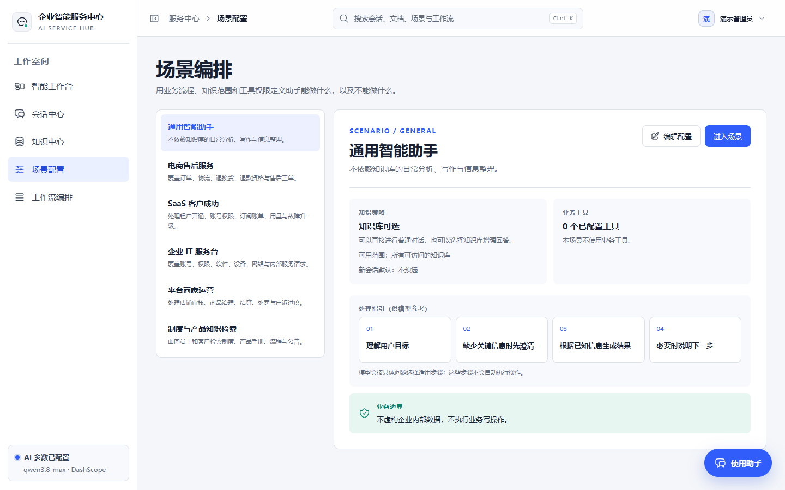
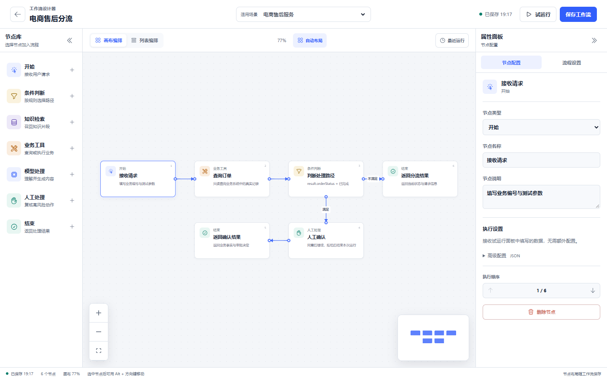

# 企业智能服务中心

一个面向真实企业客服场景的智能服务工作台，统一承载客户对话、企业知识、业务工具、链路追溯和工作流编排。

系统支持多知识库检索与来源引用、按场景授权的业务工具，以及可试运行的可视化工作流。功能操作见[业务使用指南](docs/业务使用指南.md)，配置与部署见[技术部署与维护](docs/技术部署与维护.md)。

## 项目预览

以下截图来自本地演示环境。点击图片可查看原图。

| 智能工作台 | 会话中心 |
| --- | --- |
| [](docs/screenshots/workbench.png) | [](docs/screenshots/conversation.png) |

| 知识中心 | 场景配置 |
| --- | --- |
| [](docs/screenshots/knowledge-base.png) | [](docs/screenshots/scenario.png) |

**工作流设计器**

[](docs/screenshots/workflow-designer.png)

## 快速开始

### 环境要求

- 本地开发：JDK 17、Maven、Node.js 22、MySQL 8。
- 容器部署：Docker Compose；不使用 Docker 的 Linux 部署见[技术部署与维护](docs/技术部署与维护.md#linux-无-docker-部署)。

### 全新环境使用 Docker Compose

在项目根目录将 `.env.docker.example` 复制为 `.env.docker`，填写数据库、Root 和管理员密码。启动 MySQL、后端和 Web：

```sh
docker compose --env-file .env.docker -f compose.yaml config --quiet
docker compose --env-file .env.docker -f compose.yaml up -d --build
docker compose --env-file .env.docker -f compose.yaml ps
```

访问 `http://localhost:15175`。默认端口仅绑定 `127.0.0.1`；已有数据卷或旧版配置请先按[技术部署与维护](docs/技术部署与维护.md)核对和备份，再调整 Compose 配置。模型能力默认关闭；需要真实问答与知识索引时，设置 `SERVICE_AI_ENABLED=true` 和有效的 `SERVICE_AI_DASHSCOPE_API_KEY`。未启用模型时仍可试运行不依赖 AI 的工作流。

### 本地开发

先在 MySQL 8 中创建业务库：

```sql
CREATE DATABASE IF NOT EXISTS ai_chatbot CHARACTER SET utf8mb4 COLLATE utf8mb4_unicode_ci;
```

将 `ai-chatbot-service/.env.development.example` 复制为同目录的 `.env.development`，填写 `DB_URL`、`DB_USERNAME`、`DB_PASSWORD`。从后端目录启动，以便读取该文件：

```sh
cd ai-chatbot-service
mvn spring-boot:run
```

另开终端启动前端：

```sh
cd ai-chatbot-web
npm ci
npm run dev
```

访问 `http://localhost:5173`。初始管理员账号只在数据库首次创建该用户时生效，开发环境的默认值及修改方式见[业务使用指南](docs/业务使用指南.md#登录)；部署环境应在首次启动前设置独立密码。

## 文档入口

- [业务使用指南](docs/业务使用指南.md)：面向客服、运营、知识管理员和业务负责人，介绍实际使用方式与典型场景。
- [技术部署与维护](docs/技术部署与维护.md)：面向部署与维护人员，介绍 Docker、Linux 原生部署、配置、数据和接口。
- [数据库迁移脚本说明](database/README.md)：仅供已有旧版本机数据库迁移时参考，全新部署不需要执行。

## 核心能力

- **会话与知识：**普通聊天和单会话最多 3 个知识库的 RAG 检索；支持 PDF、TXT、Markdown，展示文档来源、原文片段与检索链路。回答通过 SSE 逐段呈现，支持附件、Markdown、公式及完成后渲染的 Mermaid 图表。
- **场景与工具：**每个业务场景可设置知识策略、可用知识库、默认选择、业务工具和处理指引；服务端按场景授权工具。创建工单先生成草案，经用户独立确认后才写入。
- **工作流：**Vue Flow 画布与列表编排，支持条件分支、节点配置、运行前检查、流式试运行和人工确认后的恢复执行。
- **工作台与安全：**全局搜索覆盖会话、知识、场景及工作流；登录使用 HttpOnly 会话和 CSRF 校验，敏感配置不返回前端。

## 项目目录

- `ai-chatbot-web`：Vue 3 企业工作台。
- `ai-chatbot-service`：Spring Boot、Spring AI、MySQL、RAG 与业务工具。
- `database`：旧版数据库的可选迁移脚本与说明；全新部署不需要执行。
- `docs`：业务介绍与技术文档。
